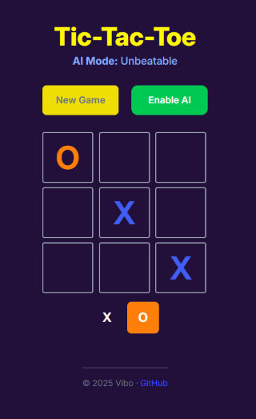

<div align="center">

<p>
  
  
  <a href="https://react-weather-app-indol-five.vercel.app" target="_blank" rel="noopener noreferrer">
    
  </a>
</p>


# Tic-Tac-Toe AI: Unbeatable Game Experience



A fun, mobile-friendly Tic-Tac-Toe game with an unbeatable AI (minimax), built using React, TypeScript, Tailwind CSS, and MUI.

## [🎮 Play Live Demo](https://tic-tac-toe-bay-mu-94.vercel.app/)

</div>

## 🛠️ Tech Stack

- **React 19** - Component-based UI development
- **TypeScript** - Static typing for robust code architecture
- **Tailwind CSS** - Utility-first styling for pixel-perfect design
- **Vercel** - Seamless deployment and hosting
- **Material UI (MUI)** - Premium UI components with custom theming
- **Minimax Algorithm** - Advanced recursive AI decision making

## ✨ Key Features

- 🧠 **Unbeatable AI** using minimax algorithm for perfect gameplay
- 🎭 **Dual Game Modes** - Play against AI or with a friend
- 📱 **Fully Responsive** design for all device sizes
- 🌓 **Custom UI Components** using MUI integration
- ✨ **Smooth Animations** for mark placement and state changes
- 🏆 **Real-time Game State** tracking and win detection
- 🔄 **Easy Reset** and game mode switching

## 🚀 Getting Started

```bash
# Clone your portfolio repo
git clone https://github.com/viboverse/my-portfolio.git

# Go into the Tic-Tac-Toe app folder
cd my-portfolio/tic-tac-toe-game-app

# Install and run
npm install
npm run dev
```

---

_Designed & Developed by [vibo] - 2025_
